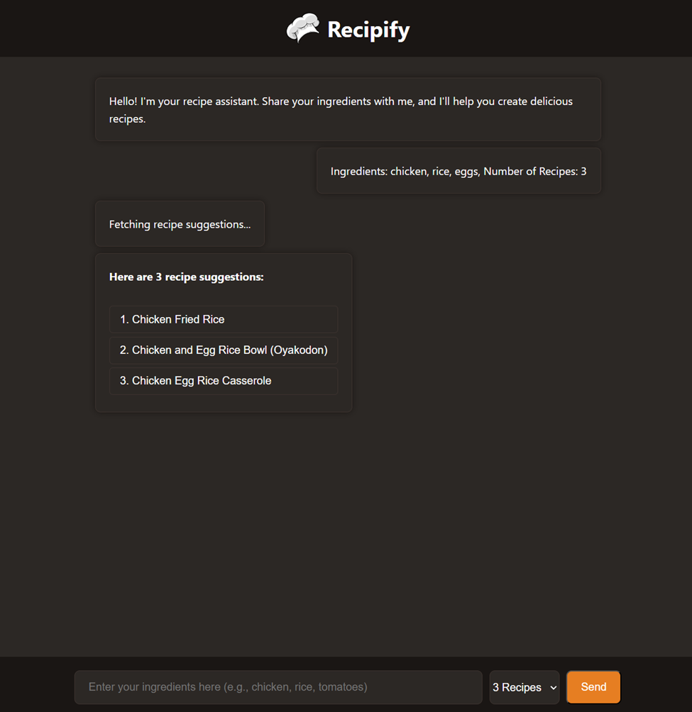
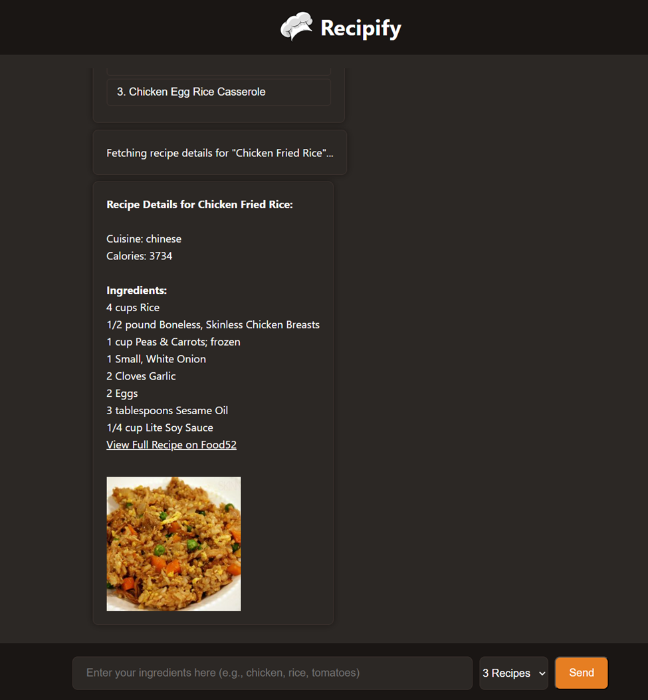

# Recipify

**Recipify** is an AI-powered recipe recommendation web app that helps you find delicious meals based on the ingredients you already have at home. It combines GPT-4o for creative recipe suggestions and the Edamam API for detailed recipe data like ingredients, calories, and images.

---

## Features

- Input your available ingredients in plain text
- GPT-4o suggests creative recipe ideas
- Edamam API provides real recipes with images, nutrition, and links
- Chat-style interface for a friendly user experience

---

## Tech Stack

- **Frontend**: HTML, CSS, JavaScript
- **Backend**: Node.js, Express
- **AI**: OpenAI GPT-4o API
- **Recipe Data**: Edamam Recipe API

---

## Setup Instructions

### 1. Clone the Repository

```bash
git clone https://github.com/NoahB667/recipify.git
cd recipify
```

### 2. Install Dependencies
```bash
npm install
```

### 3. Configure Environment Variables
Create a .env file in the root directory and add your API keys:

GITHUB_TOKEN=your_github_token_key<br>
EDAMAM_APP_ID=your_edamam_app_id<br>
EDAMAM_APP_KEY=your_edamam_app_key

More about GitHub personal access tokens:https://docs.github.com/en/authentication/keeping-your-account-and-data-secure/managing-your-personal-access-tokens

For Edamam API, make sure you switch from Meal Planner Developer plan to Minimum Service (free plan): https://www.edamam.com/

### 4. Run the server
```bash
node app.js
```

### 5. Open the APP
The server will start on http://localhost:5000.

## Preview

